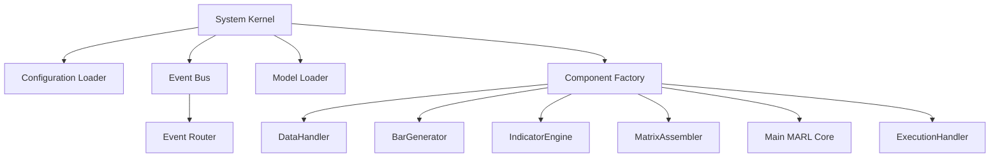

# Product Requirements Document (PRD): System Kernel & Orchestration

**Document Version**: 2.0  
**Date**: 2025-06-19  
**Status**: Refined  
**Component**: System Kernel & Orchestration  

## 1.0 Overview

### 1.1 Purpose
The System Kernel & Orchestration is the central nervous system of the AlgoSpace trading platform. It serves as the application entry point, dependency injection container, and event-driven architecture coordinator. This component ensures all system modules work in perfect harmony while providing robust lifecycle management and graceful error handling.

### 1.2 Scope

**In Scope:**
- Master configuration loading and validation (settings.yaml)
- Dependency injection and component instantiation
- Event bus initialization and event routing setup
- System lifecycle management (startup, shutdown, error recovery)
- Signal handling (SIGINT, SIGTERM) for graceful shutdown
- Model loading and distribution to AI components
- Operational mode switching (live/backtest)

**Out of Scope:**
- Business logic implementation (delegated to specialized components)
- Direct market data processing
- Trading decision making
- User interface implementation

### 1.3 Architectural Position
The Kernel sits at the center of the event-driven architecture, orchestrating the flow between:
- DataHandler ↔ BarGenerator ↔ IndicatorEngine ↔ MatrixAssembler ↔ Main MARL Core ↔ ExecutionHandler

## 2.0 Functional Requirements

### FR-SK-01: Configuration-Driven Architecture
**Requirement**: The system MUST be entirely configuration-driven via a master settings.yaml file.

**Specification**:
```yaml
# settings.yaml structure
system:
  mode: "live" | "backtest"
  log_level: "INFO" | "DEBUG" | "WARNING" | "ERROR"
  shutdown_timeout: 30  # seconds
  
event_bus:
  max_queue_size: 10000
  worker_threads: 4
  
models:
  rde_model_path: "models/rde_model.pth"
  marl_model_path: "models/marl_model.pth"
  risk_model_path: "models/risk_model.pth"
  
data_handler:
  mode: "live" | "backtest"
  # ... component-specific configs
```

**Validation**: The Kernel MUST validate all configuration parameters at startup and provide detailed error messages for invalid configurations.

### FR-SK-02: Dependency Injection System
**Requirement**: The Kernel MUST implement a clean dependency injection pattern for all system components.

**Specification**:
```python
class SystemKernel:
    def __init__(self, config_path: str):
        self.config = self._load_config(config_path)
        self.event_bus = EventBus()
        self.components = {}
        
    def _create_components(self):
        # Instantiate components based on configuration
        if self.config['system']['mode'] == 'live':
            self.components['data_handler'] = LiveDataHandler(
                config=self.config['data_handler'],
                event_bus=self.event_bus
            )
        else:
            self.components['data_handler'] = BacktestDataHandler(
                config=self.config['data_handler'],
                event_bus=self.event_bus
            )
        # ... other components
```

### FR-SK-03: Event Bus Orchestration
**Requirement**: The Kernel MUST initialize and configure the central event bus with all necessary event routing.

**Event Routing Table**:
| Event Type | Producer | Consumer(s) |
|------------|----------|-------------|
| NEW_TICK | DataHandler | BarGenerator |
| NEW_5MIN_BAR | BarGenerator | IndicatorEngine |
| NEW_30MIN_BAR | BarGenerator | IndicatorEngine |
| INDICATORS_READY | IndicatorEngine | MatrixAssembler (×3) |
| EXECUTE_TRADE | Main MARL Core | ExecutionHandler |
| TRADE_CLOSED | ExecutionHandler | Performance Tracker |

### FR-SK-04: Model Loading and Distribution
**Requirement**: The Kernel MUST load all pre-trained models and distribute them to appropriate components.

**Specification**:
```python
def _load_models(self):
    models = {}
    for model_name, model_path in self.config['models'].items():
        if os.path.exists(model_path):
            models[model_name] = torch.load(model_path, map_location='cpu')
            logger.info(f"Loaded model: {model_name}")
        else:
            logger.warning(f"Model not found: {model_path}")
    return models
```

### FR-SK-05: System Lifecycle Management
**Requirement**: The Kernel MUST provide comprehensive system lifecycle management.

**Startup Sequence**:
1. Load and validate configuration
2. Initialize logging system
3. Load pre-trained models
4. Create event bus
5. Instantiate all components
6. Wire event subscriptions
7. Start data stream
8. Begin main event loop

**Shutdown Sequence**:
1. Stop data stream
2. Cancel pending orders (if in live mode)
3. Close open positions (if configured)
4. Flush all event queues
5. Save system state
6. Close database connections
7. Exit with appropriate code

### FR-SK-06: Error Handling and Recovery
**Requirement**: The Kernel MUST provide robust error handling and recovery mechanisms.

**Error Categories**:
- **Configuration Errors**: Invalid settings, missing files → Immediate shutdown
- **Component Errors**: Component initialization failure → Graceful degradation
- **Runtime Errors**: Transient failures → Retry with exponential backoff
- **Fatal Errors**: Unrecoverable states → Emergency shutdown with position protection

### FR-SK-07: Signal Handling
**Requirement**: The Kernel MUST handle system signals gracefully.

**Signal Handlers**:
```python
def _setup_signal_handlers(self):
    signal.signal(signal.SIGINT, self._graceful_shutdown)
    signal.signal(signal.SIGTERM, self._graceful_shutdown)
    
def _graceful_shutdown(self, signum, frame):
    logger.info(f"Received signal {signum}, initiating graceful shutdown...")
    self.shutdown_requested = True
    # Trigger shutdown sequence
```

## 3.0 Interface Specifications

### 3.1 Command Line Interface
```bash
# Basic usage
python main.py

# With custom config
python main.py --config custom_settings.yaml

# Backtest mode
python main.py --mode backtest --config backtest_config.yaml

# Debug mode
python main.py --debug --log-level DEBUG
```

### 3.2 Configuration Interface
The Kernel exposes configuration through a single YAML file with schema validation.

### 3.3 Event Interface
The Kernel provides the event bus interface to all components:
```python
class EventBus:
    def publish(self, event_type: str, payload: Any) -> None
    def subscribe(self, event_type: str, callback: Callable) -> None
    def unsubscribe(self, event_type: str, callback: Callable) -> None
```

## 4.0 Dependencies & Interactions

### 4.1 External Dependencies
- **Operating System**: Linux/Windows process management
- **File System**: Configuration files, model files, log files
- **Python Runtime**: Python 3.9+ with required packages
- **Signal Handling**: OS-level signal processing

### 4.2 Internal Dependencies
The Kernel has dependencies on ALL other system components as it orchestrates their initialization and coordination.

### 4.3 Component Interaction Flow


## 5.0 Non-Functional Requirements

### 5.1 Performance
- **NFR-SK-01**: System startup time MUST be under 10 seconds
- **NFR-SK-02**: Event bus latency MUST be under 1ms per event
- **NFR-SK-03**: Memory usage MUST remain stable (no memory leaks)

### 5.2 Reliability
- **NFR-SK-04**: System MUST handle 99.9% of component failures gracefully
- **NFR-SK-05**: Configuration validation MUST catch 100% of invalid settings
- **NFR-SK-06**: Emergency shutdown MUST complete within 5 seconds

### 5.3 Maintainability
- **NFR-SK-07**: Adding new components MUST require changes only to configuration
- **NFR-SK-08**: Event routing MUST be clearly documented and traceable
- **NFR-SK-09**: All system states MUST be logged with appropriate severity levels

### 5.4 Security
- **NFR-SK-10**: API credentials MUST be loaded from environment variables
- **NFR-SK-11**: Configuration files MUST NOT contain sensitive information
- **NFR-SK-12**: All file operations MUST use secure path validation

## 6.0 Implementation Specifications

### 6.1 Technology Stack
- **Primary Language**: Python 3.9+
- **Configuration**: PyYAML with schema validation
- **Logging**: Python logging with structured output
- **Event System**: Custom asyncio-based implementation
- **Process Management**: asyncio for concurrent operations

### 6.2 Key Libraries
```python
# Core dependencies
import asyncio
import signal
import logging
import yaml
import torch
import os
from pathlib import Path
from typing import Dict, Any, Callable
from dataclasses import dataclass
from abc import ABC, abstractmethod
```

### 6.3 Error Handling Patterns
```python
class SystemError(Exception):
    """Base class for system-level errors"""
    pass

class ConfigurationError(SystemError):
    """Raised when configuration is invalid"""
    pass

class ComponentError(SystemError):
    """Raised when component initialization fails"""
    pass
```

## 7.0 Testing Requirements

### 7.1 Unit Tests
- Configuration loading and validation
- Component instantiation
- Event bus functionality
- Signal handling
- Error recovery mechanisms

### 7.2 Integration Tests
- Full system startup/shutdown cycles
- Event flow between components
- Configuration-driven behavior changes
- Error propagation and handling

### 7.3 Performance Tests
- Startup time benchmarks
- Event bus throughput testing
- Memory usage monitoring
- Stress testing with high event volumes

## 8.0 Future Enhancements

### 8.1 V2.0 Features
- **Plugin Architecture**: Dynamic component loading
- **Distributed Deployment**: Multi-process coordination
- **Hot Configuration Reload**: Runtime configuration updates
- **Advanced Monitoring**: Prometheus metrics integration
- **Health Checks**: Component health monitoring and reporting

### 8.2 Scalability Improvements
- **Horizontal Scaling**: Multi-instance coordination
- **Event Persistence**: Durable event storage
- **Load Balancing**: Intelligent event distribution
- **Fault Tolerance**: Automatic failover mechanisms

This PRD provides the foundation for a robust, scalable, and maintainable system kernel that can orchestrate complex trading operations while maintaining high reliability and performance standards.